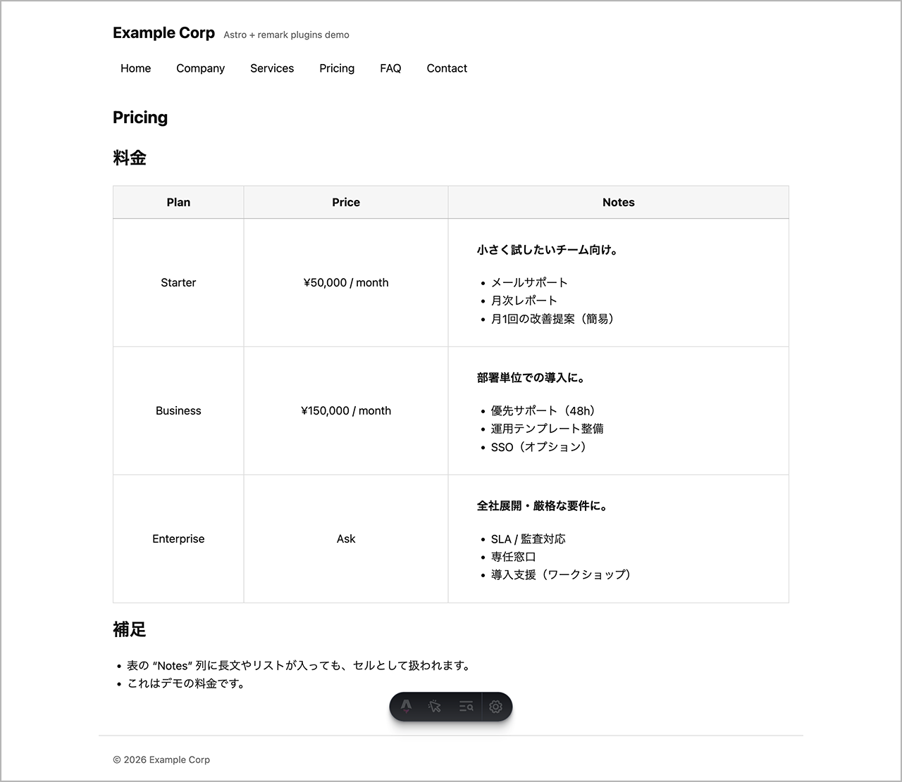

# Astro + remark-dl-list / remark-pipe-table サンプルサイト



Astro 上で remark-dl-list / remark-pipe-table を組み合わせて利用する、コーポレートサイト構成のサンプルプロジェクトです。

## このサンプルで確認できること

- Astro で remark プラグインを組み合わせて使用する方法
- コロン記法による説明リスト（dl / dt / dd）の記述と出力結果
- 縦に展開できる pipe-table 記法の書き方と可読性
- コーポレートサイトを想定した Markdown コンテンツ構成
- VS Code プレビューと Astro ビルド結果の対応関係

## 特徴

- Astro 標準の Markdown 機能を利用
- GFM テーブルを無効化し、`pipe-table` 記法を使用
  - pipe-table の中で他の GFM タグは使用可能に
- Markdown 内で以下のような表現が可能
  - 説明リスト（用語集・サービス一覧など）
  - 長文を含む表・縦に展開できる表
- コーポレートサイトを想定したシンプルな構成

## 使用技術

- [**Astro**](https://astro.build/)
- **dl-list**
  - [remark-dl-list](https://www.npmjs.com/package/remark-dl-list)
  - [hast-util-dl-list](https://www.npmjs.com/package/hast-util-dl-list)
- **pipe-table**
  - [remark-pipe-table](https://www.npmjs.com/package/remark-pipe-table)
  - [hast-util-pipe-table](https://www.npmjs.com/package/hast-util-pipe-table)

## セットアップ

```bash
npm install
npm run dev
```

開発サーバーを起動後、ブラウザで以下にアクセスします。

```
http://localhost:4321
```

## Markdown 拡張の設定例

このプロジェクトでは、[`astro.config.mjs`](./astro.config.mjs) で以下のように remark プラグインを設定しています。

```js
import { defineConfig } from 'astro/config';

import remarkGfm from 'remark-gfm';
import remarkPipeTable from 'remark-pipe-table';
import remarkDlList from 'remark-dl-list';
import { pipeTableHandlers } from 'hast-util-pipe-table';
import { dlListHandlers } from 'hast-util-dl-list';

export default defineConfig({
    markdown: {
        // 1. Remark プラグインの登録
        remarkPlugins: [
            remarkGfm,
            // Pipe Table プラグインとオプションを配列として渡します
            [remarkPipeTable, {
                autoInjectGfmInlineInCells: true // 表セル内でのgfm構文を有効に
            }],
            // DL List プラグインを追加
            remarkDlList,
        ],
        // 2. Rehype (mdast -> hast) 変換時のハンドラー設定
        remarkRehype: {
            handlers: {
                ...pipeTableHandlers(),
                ...dlListHandlers(),
            },
        },
    },
});
```

## VS Code 拡張機能（推奨）

本プロジェクトは VS Code 拡張をインストールしなくても動作しますが、  
Markdown 編集時の可読性と確認しやすさを向上させるため、
VS Codeを使用される方は、以下の拡張機能の利用を推奨します。

- [DL List Preview (colon-based)](https://marketplace.visualstudio.com/items?itemName=kanemu-dev.vscode-dl-list-preview)
- [Pipe Table Preview for VS Code](https://marketplace.visualstudio.com/items?itemName=kanemu-dev.vscode-pipe-table-preview)

Astro のプレビューやビルド結果とほぼ同じ表示を、VS Code 上で確認できます。

## 記法サンプル

このサンプルで使われている実際の markdown ファイルは、
[`./src/content/pages`](./src/content/pages) 以下にあります。

### 説明リスト（dl-list）

```markdown
: サービスA
    : Webサイト制作
    : UI/UXデザイン
```

### Pipe Table

```markdown
| プラン
    | 内容
    | 価格
|-
| Basic
    | 小規模サイト向け
    | ¥10,000
| Pro
    | 企業サイト向け
    | ¥30,000
```

## 想定ユースケース

* コーポレートサイト
* サービス紹介ページ
* 料金表・仕様一覧
* 用語集・FAQ

## 関連プロジェクト

* [unified-dl-list](https://github.com/kanemu/unified-dl-list)
* [unified-pipe-table](https://github.com/kanemu/unified-pipe-table)

## ライセンス

MIT
